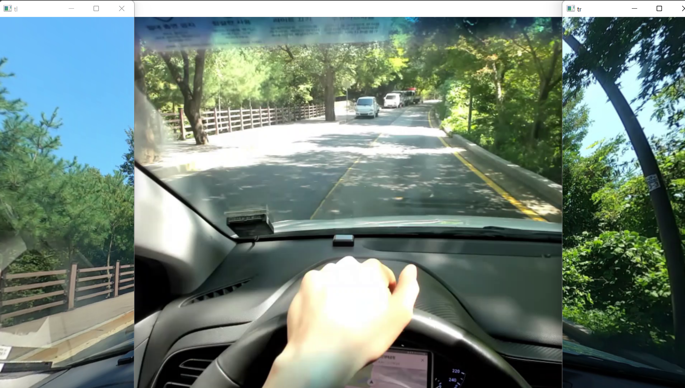

# 시점 변환
### <목표> 
A필러에 띄우는 영상이 운전자의 시점과 일치할 수 있도록 양쪽 A필러 영상을 조절할 수 있도록 한다.

## 문제 사항
원본 파일 origin을 기준으로 
  1. 왼쪽 창(왼쪽 A필러)만 보임 
  2. A필러의 창과 운전자 시점의 영상 같음 
  3. Wasd 키 delay 
  4. wasd 키 활성화 
  5. 코드 최적화 

## 수정 사항
1. 오른쪽 A필러 띄우기 
  왼쪽 창을 띄우는 것과 마찬가지로 이미지 끝의 좌표를 잡고
  getPerspectiveTransform 함수를 통해 변환행렬을 구한 뒤, 
  warpPerspective 함수를 통해 시점 변환  
2. A필러의 창과 운전자 시점의 영상 달리하기
  중간에 보이는 창은 
  운전자 시점의 영상, 양 옆의 A필러 부분은 빌트인 캠 영상. 
  → 문제점 : 적절한 영상을 찾기 힘듬 
      1) 웹캠 영상과 빌트인 캠의 영상의 구도가 너무 다름 
      2) 웹캠 영상이 너무 밝아 영상의 편집이 필요  
3. wasd 키 delay 
  wasd 키를 사용해 사용자의 시점에 맞도록 개인적으로 조절 
  → 문제점 : wasd 키를 최소 3번씩은 눌러야 적용이 됨 cv2.waitkey 때문으로 추측 
      1) cv2.waitkey 대신 keyboard.is_pressed를 사용, 키보드 눌림이 감지되면 움직임
        → 버퍼? 때문인지 하나씩 밀려 출력됨. 임시방편으로 작동은 되게 해둠  
4. wasd 키 활성화
  wasd 중 wa만 활성화 되어있음 
      1) w: 좌표 위로 올리기, a: 사진 왼쪽으로 기울이기, 
        x: 좌표 아래로 내리기, d: 사진 오른쪽으로 기울이기  
5. 코드 최적화
  중복되는 부분 코드 최적화 

  
