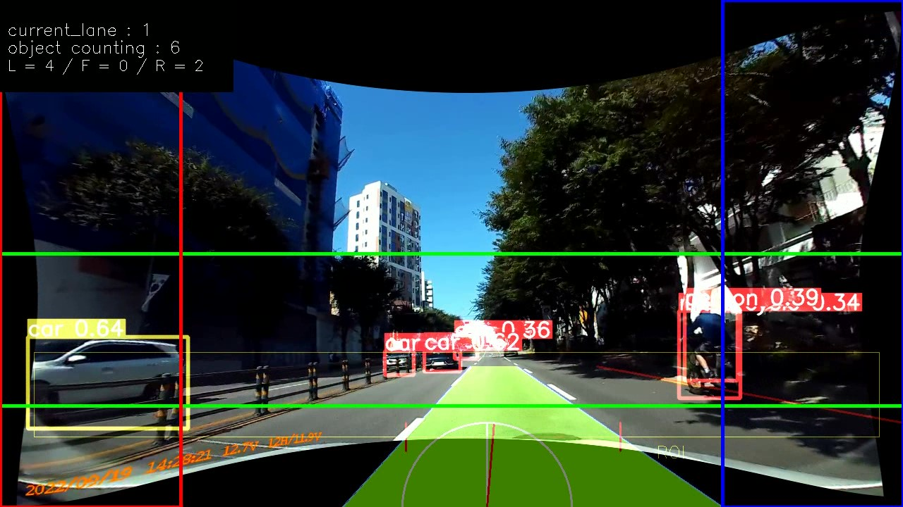

# Team JJIDLE
Built in Driving Assitant   
내장형 블랙박스를 이용한 운전자 시야확장 시스템   
> 블랙박스가 운전자에 비해 시야가 더 넓다는 것을 이용해
> (1) 교차로에서 우회전 시, 운전자보다 사람을 먼저 인식해 경고로 사고 예방
> (2) 경사로에서 보이지 않는 시야각으로 발생할 수 있는 사고 예방
> (3) A 필러 부근 보이지 않는 시야 확장 
> 할 수 있는 시스템 개발



## <div align="center">Team member</div>

| 이름   | 메일               | 역할 |
| ------ | ------------------ | ------ |
| 정우진 | woo9904@konkuk.ac.kr | 기획, 총괄 및 개발<br/>우회전 인식 시스템 개발 <br/>object detecting 알고리즘 개발|
| 박승철 | psc0526@konkuk.ac.kr | A필러 부분 시점변환 개발<br/>서버 환경 구축 & 서버 코드 개발<br/>이미지 전처리 개발 |
| 신지혜 | long0404@konkuk.ac.kr | H/W개발 – 라즈베리파이 & 서버간 통신 시스템 개발<br/>언어관련 딥러닝 클라이언트 개발<br/>센서 및 소리 및 LED제어 |
| 이서연 | seoyeon8167@konkuk.ac.kr | H/W개발 – 라즈베리파이 & 서버간 통신 시스템 개발<br/>model 검색 및 알고리즘 최적화 <br/>다양한 모드 연동|

## <div align="center">Quick Start Examples</div>
### 주의사항

> 실행은 
> 
> - server : CUDA 필요
> - [YOLOV5](https://github.com/ultralytics/yolov5) 설치 필요 
> - raspberry pi, server pip install -r requirments.txt

<details open>
<summary>1. Server Computer Install</summary>

객체 검출의 bashline 코드는 이 [Yolov5](https://github.com/ultralytics/yolov5/blob/master/requirements.txt) 코드를 참고하였다.    
Environment 또한 동일하게 
[**Python>=3.7.0**](https://www.python.org/) 환경에, 
[**PyTorch>=1.7**](https://pytorch.org/get-started/locally/)가 필요하다.   
리눅스 OS 환경에 설치하였다. 

> 1. baseline으로 사용한 yolov5 6.2ver을 clone 한다.
```bash
git clone https://github.com/ultralytics/yolov5  # clone
cd yolov5
pip install -r requirements.txt  # install
```

> 2. 본 코드의 코드를 clone 한다. 
```bash
cd ../
git clone https://github.com/konkuksw22/esw22_JJIDLE5  # clone
```

> 3. "server_source" directory의 main_server.py 코드를 yolov5 폴더에 복사한다. 
```bash
cd esw22_JJIDLE5/server_source
cp main_server.py ../yolov5
```

> 4. 코드 실행을 위한 코드 수정 및 후 처리   
> CUDA 설치 필요. CUDA 실행을 위한 주석 처리(어떤건지 알고 작성하기!)
> yolov5/utils/dataloaders.py 변경
```bash
cd esw22_JJIDLE5
rm ../../yolov5/utils/dataloaders.py
cp server_source/dataloaders.py ../yolov5/utils
```
이로서 서버에서 필요한 준비는 모두 끝났다. 
</details>

<details open>
<summary>2. Raspberry Pi Install</summary>

본 GitHub의 코드를 clone하여 "raspberryPi4_source" directory의 코드를 설치한다. 

```bash
git clone https://github.com/konkuksw22/esw22_JJIDLE5  # clone
cd raspberryPi4_source
```
</details>

<details open>
<summary>3. server raspberry pi 통신 준비 </summary>

raspberry pi와 server를 연결하기 위한 작업을 준비한다.    
(지혜한테 듣기)

</details>

<details open>
<summary>4. 동작 시키기 </summary>

> 1. 저장된 영상 주행으로 실행시키기
```Shell
$ python main_server.py --source source_video_name --weights weights/yolov5n.pt --img 640 --view-img
  ㄴ main_server.py
      ㄴ /utils/dataloaders.py
```

> 2. 실시간 카메라로 영상 받아 실행하기.

</details>

## <div align="center">documnets</div>

### github Tree

```bash
│  README.md
│  
├─camera_cal 
│      img.png
```

### 전체 구성도
사진 넣기


### 알고리즘

#### 1. server
#### 1-1. 파일 구성
```Shell
$ python main_server.py --source source_video_name --weights weights/yolov5n.pt --img 640 --view-img
  ㄴ main_server.py
      ㄴ /utils/dataloaders.py
```

##### 1-2. 함수 설명 및 특징
- Send Tokens to RPi
  - Uncomment lines
  ```Shell
  clientSocket.connect((ip,port))
  listsend(message, clientSocket)
  ```
- dataloaders.py (Update : 2022.9.27. 01:00)
  - Image resize (dst : 1280 * 720)
  - Histogram equalization (Normalize Intensity)
  - Undistortion
  ```Shell
  # -----------------------------------------------------------------------------------------------
  cv2.imshow("Original Image", im0)
  im0 = cv2.cvtColor(im0, cv2.COLOR_BGR2YUV)  # Convert colorspace to YUV, seperate Intensity channel
  print(im0.shape)
  im0[:,:,0] = cv2.equalizeHist(im0[:,:,0])   # Normalize Intensity
  im0 = cv2.cvtColor(im0, cv2.COLOR_YUV2BGR)  # Convert to RGB
  cv2.imshow("Equalized Image", im0)
  # -----------------------------------------------------------------------------------------------
  height, width = im0.shape[:2]
  newcameramtx, roi = cv2.getOptimalNewCameraMatrix(mtx, dist, (width, height), 1)
  im0 = cv2.undistort(im0, mtx, dist, None, newcameramtx)
  cv2.imshow("Undistored Image", im0)
  # -----------------------------------------------------------------------------------------------
  ```

#### 2. Raspberry pi 4
##### 2-1. 파일 구성
```Shell
$./Alltime.sh
  ㄴ Web Streamer
    ㄴ ./wandlab-cv-streamer-master
  ㄴ perspective transform
  ㄴ Main HW ( + Socket)
```
##### 2-2. 특징

- Web Streamer : `./wandlab-cv-streamer-master/wandlab-cv-streamer.py`
    - `wandlab-cv-streamer-master` 경로 내 타 python 파일 `import` 중
- Perspective Transform : `./perspective/t.py (option)`
    - sudo 권한으로 실행 (`Alltime.sh`에 해당 내용 포함됨)
    - option :
        - '0' : 초기설정(방향값 .txt에 저장과정 포함)
        - '1' : 기존 설정값으로 transform 바로 진행 (`Alltime.sh`에는 이 옵션으로 포함됨)
- Main HW (+ Socket) : `./accelerometer.py`
    - 파라미터 1개 `$ChatPort` 필요(shell에서 지정됨)
    - Socket, ADXL, Switch, LED 등 Main 출력부 제어 포함
    - Speaker 제어 포함 

client로부터 받은 문자열을 3개(pillar, hill, right)로 나눈 후 각각에 맞는 HW 및 처리 진행


### Computing Power

```
1. Work Station (Main)
CPU: Intel(R) Xeon(R) CPU E5-2640 v3
VGA: GTX1080Ti SLI
RAM: 32GB (+ Swap Memory 96GB)
HDD: SSD 1TB / HDD 3TB
CUDA 10.1
CUDNN 8.6

```

## HW
>하드웨어 구성
>- Raspberry Pi 4B+
>- HiFiBerry DAC+ ADC pro
>- USB SoundCard

## TODOS

- 실시간 영상처리 최적화
- 객체 인식 학습
- 최적의 이미지 전처리 