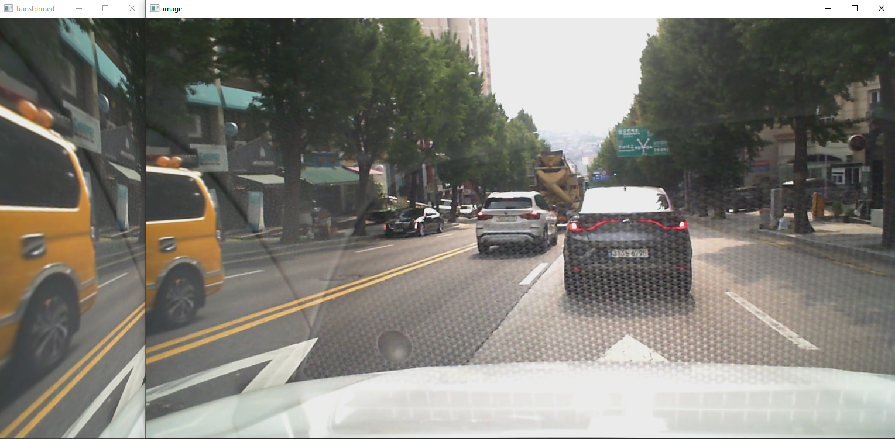
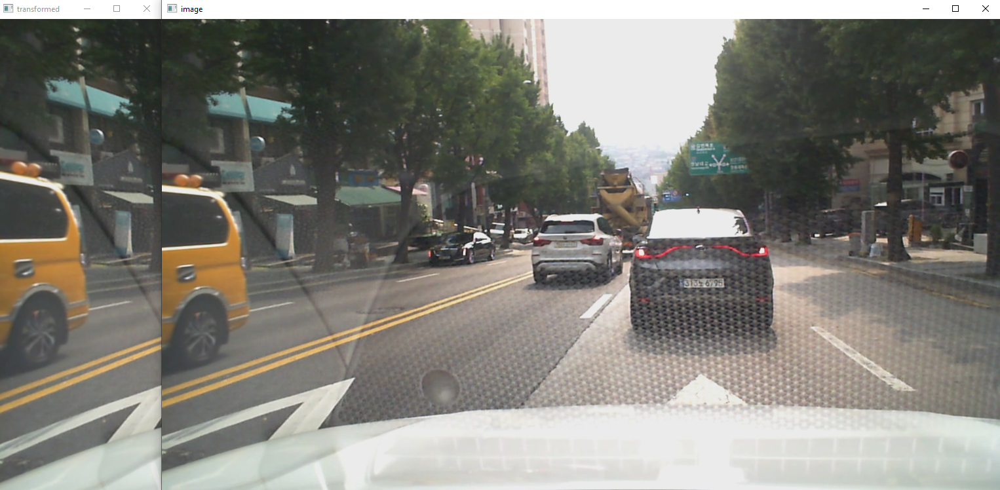

# A-pillar blind spot solution
## Perspective transform

```python
import cv2
import numpy as np


def perspective_transform(img, pts):

    topLeft = pts[0]
    topRight = pts[1]
    bottomLeft = pts[2]
    bottomRight = pts[3]

    # 변환 전 4개 좌표
    pts1 = np.float32([topLeft, topRight, bottomRight, bottomLeft])
    # print(pts1)

    # 변환 후 영상에 사용할 이미지의 폭과 높이 계산
    w1 = abs(bottomRight[0] - bottomLeft[0])
    w2 = abs(topRight[0] - topLeft[0])
    h1 = abs(topRight[1] - bottomRight[1])
    h2 = abs(topLeft[1] - bottomLeft[1])
    width = max([int(w1), int(w2)])  # 두 좌우 거리간의 최대값이 서류의 폭
    height = max([int(h1), int(h2)])  # 두 상하 거리간의 최대값이 서류의 높이
    
    # 변환 후 4개 좌표
    pts2 = np.float32([[0, 0], [width - 1, 0],
                       [width - 1, height - 1], [0, height - 1]])

    # 변환 행렬 계산
    mtrx = cv2.getPerspectiveTransform(pts1, pts2)
    # print(mtrx)
    
    # 변환 적용
    result = cv2.warpPerspective(img, mtrx, (width, height))
    cv2.imshow('transformed', result)


pts = np.zeros((4, 2), dtype=np.float32)
pts[0] = [0, 120]  # topLeft
pts[1] = [250, 0]  # topRight
pts[2] = [0, 620]  # bottomLeft
pts[3] = [250, 720]  # bottomRight

img = cv2.imread('bbox_2.jpg')
img = cv2.resize(img, (1280, 720))
while True:
    cv2.imshow("image", img)
    perspective_transform(img, pts)

    if cv2.waitKey() == ord('w'):
        pts[0][1] = pts[0][1] + 10
        pts[2][1] = pts[2][1] - 10
        print('w')
        print(pts)
    elif cv2.waitKey() == ord('a'):
        print('a')
    elif cv2.waitKey() == ord('s'):
        pts[0][1] = pts[0][1] - 10
        pts[2][1] = pts[2][1] + 10
        print('s')
        print(pts)
    elif cv2.waitKey() == ord('d'):
        print('d')


    if cv2.waitKey() == ord('q'):
        break
cv2.destroyAllWindows()


# Video resolution : 1280 * 720
cap = cv2.VideoCapture("220817_blackbox.mp4")
while cap.isOpened():
    ret, frame = cap.read()
    rows, cols = frame.shape[:2]

    cv2.imshow("video", frame)
    perspective_transform(frame, pts)

    if cv2.waitKey(1) & 0xFF == ord('q'):
        break

cap.release()
cv2.destroyAllWindows()
```


## 변환행렬 좌표 조절 기능
키보드(w,a,s,d)로 조절, 현재 w와 s만 구현.      

</img>   
기본 좌표

</img>   
경사가 심한 사다리꼴

</img>   
경사가 완만한 사다리꼴

## 실시간 영상 시점 변환


