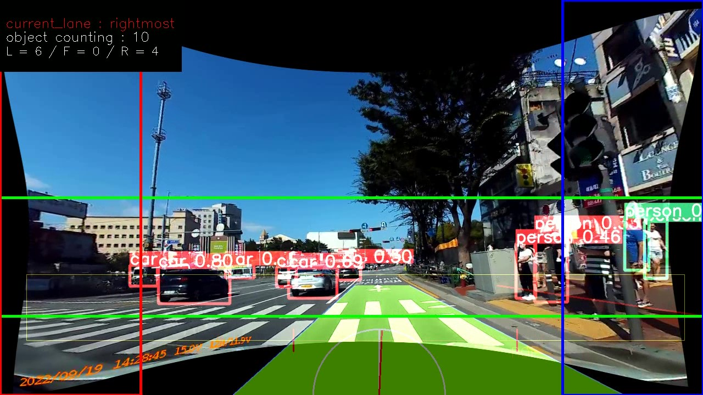

# Team JJIDLE
Built in Driving Assitant   
내장형 블랙박스를 이용한 운전자 시야확장 시스템   
   
> 블랙박스가 운전자에 비해 시야가 더 넓다는 것을 이용함.     
> (1) A 필러 부근 보이지 않는 시야 확장     
> (2) 경사로 정상에서 보이지 않는 시야각으로 발생할 수 있는 사고 예방    
> (3) 교차로에서 우회전 시, 운전자보다 사람을 먼저 인식해 경고로 사고 예방    

* 교차로 우회전 상황   

|운전자 시점|블랙박스 시점 영상 처리|
|--|--|
|||  

* 경사로 상황   

|운전자 시점|블랙박스 시점 영상 처리|
|--|--|
|||  

참고 : red box : 왼쪽 A필러 구역, blue box : 오른쪽 A필러 구역, green box : 전방 구역   

>- 교차로 우회전 경우, 차량이 맨 오른쪽에 있음을 상황 인지 후, 오른쪽 A필러 구역(Blue box area)의 사람을 감지해 운전자에게 alert   
>- 경사로 경우, 기울기 센서로 해당 차량이 경사로에 있음을 상황 인지 후, 전방 구역(Green box area)의 사람과 물체를 감지해 운전자에게 alert
>- result [Video(YOUTUBE)](https://youtu.be/pTH6UUd7XEs)

## <div align="center">Team member</div>

| 이름   | 메일               | 역할 |
| ------ | ------------------ | ------ |
| 정우진 | woo9904@konkuk.ac.kr | 기획, 총괄 및 개발<br/>우회전 인식 시스템 개발 <br/>object detecting 알고리즘 개발|
| 박승철 | psc0526@konkuk.ac.kr | A필러 시점변환 개발<br/>서버 환경 구축 & 서버 코드 개발<br/>이미지 전처리 개발 |
| 신지혜 | long0404@konkuk.ac.kr | H/W개발 – Raspberry pi 4& 서버간 통신 환경 구축<br/>웹 스트리밍 서비스 개발<br/>센서, 소리 및 LED제어 |
| 이서연 | seoyeon8167@konkuk.ac.kr |A필러 시점변환 영상처리 및 코드 최적화 <br/> Object Detection 최적 모델 선별 <br/> 데이터 선별 |

## <div align="center">Quick Start Examples</div>
### 주의사항

> 실행은 
> 
> - server : CUDA 필요
> - [YOLOV5](https://github.com/ultralytics/yolov5) 설치 필요 
> - 기타 소프트 웨어는 requirments.txt 참고

<details>
<summary>1. Server Computer Install</summary>

객체 검출의 bashline 코드는 이 [Yolov5](https://github.com/ultralytics/yolov5/blob/master/requirements.txt) 코드를 참고하였다.    
Environment 또한 동일하게 
[**Python>=3.7.0**](https://www.python.org/) 환경에, 
[**PyTorch>=1.7**](https://pytorch.org/get-started/locally/)가 필요하다.   
리눅스 OS 환경에 설치하였다. 

> 1. baseline으로 사용한 yolov5 6.2ver을 clone 한다.
```bash
git clone https://github.com/ultralytics/yolov5  # clone
cd yolov5
pip install -r requirements.txt  # install
```

> 2. 본 코드의 코드를 clone 한다. 
```bash
cd ../
git clone https://github.com/konkuksw22/esw22_JJIDLE5  # clone
```

> 3. "server_source" directory의 main_server.py 코드를 yolov5 폴더에 복사한다. 
```bash
cd esw22_JJIDLE5/server_source
cp main_server.py ../yolov5
```

> 4. 코드 실행을 위한 코드 수정 및 후 처리   
> CUDA 설치 필요. 
> yolov5/utils/dataloaders.py 변경
```bash
cd esw22_JJIDLE5
rm ../../yolov5/utils/dataloaders.py
cp server_source/dataloaders.py ../yolov5/utils
```
이로서 서버에서 필요한 준비는 모두 끝났다. 
</details>

<details>
<summary>2. Raspberry Pi Install</summary>

본 GitHub의 코드를 clone하여 "raspberryPi4_source" directory의 코드를 설치한다. 

```bash
git clone https://github.com/konkuksw22/esw22_JJIDLE5  # clone
cd raspberryPi4_source
```
</details>

<details>
<summary>3. 프로그램 사용하기 </summary>

> 1. Rpi4 준비   
> webstream 통신을 위한 ip를 accelerometer.py에 입력한다.
```bash
host = '203.###.###.##' #여기에 입력
port = int(sys.argv[1])
```
> Web server streaming 활성화, perspective_transform 영상 송출, 하드웨어 제어 파일을 동시에 실행한다.
```Shell
$ ./Alltime.sh 
```
> 2. Server 준비
> RPi 4와 연결을 하여 영상 이미지 받을 준비를 한다. 이때 통신을 위한 ip를 입력한다. 
```bash
ip='203.###.##.##' #여기에 입력
port=____
```
> 실시간 영상을 받아 서버에서 이미지 처리를 하고 판단 결과를 다시 RPI에 토큰으로 전송한다. 
> 저장된 영상으로 실행시키는 방법
```Shell
$ python main_server.py --source "source_video_name" --weights weights/yolov5n.pt --img 640 --view-img
```
> 실시간 영상으로 실행시키는 방법
```Shell
$ python main_server.py --source 0 --weights weights/yolov5n.pt --img 640 --view-img
```
</details>

## <div align="center">documents</div>

### github Tree

```bash
 │ README.md
 │ 
 ├── raspberryPi3_source
 │		   ├── wandlab-cv-streamer-master
 │		   │		├── wandlab.cv.streamer.py
 │		   │		└── webcam.test.py
 │		   ├── Alltime.sh
 │		   ├── accelerometer.py
 │		   └── perspective_transform.py
 ├── server_source
 │	   ├── camera_cal           #for camera calibration sources
 │     │	  	├── imags.png
 │	   ├── calibration_code.py  #for camera calibration
 │	   ├── dataloaders.py       #for image preprocessing
 │	   ├── main_server.py       #for server computer 
 │		 └── socketserver01.py    
 └── 일지
```

### 전체 구성도
<p align="center"></p>

시스템 구현 과정은 아래와 같이 5단계로 설명이 가능하다.  
- 1) Built-in-Camera(RPI4)로 영상 데이터 수집     
- 2) 처리속도 향상을 위해 영상 데이터 서버로 전송   
- 3) 서버에서 영상 데이터를 통해 운전자 상황 인식   
- 4) 객체인식 및 알람을 위해 RPI로 토큰 전송
- 5) RPI4에서 상황별 위험 알람   

### 하드웨어 구성도
<p align="center"></p>

본 시스템은 Hardware에서 간단한 처리 및 감지를 하고 주요 내용은 Server에서 진행한다. 따라서 Hardware는 비교적 간단하게 구성되어 있다. 
- Raspberry Pi 4B+ : 차량에 부착될 Embedded Board
- ADXL345 : 경사로임을 감지해 Hill Mode를 작동시키기 위한 기울기센서
- Neopixel Strip LED : 사용자에게 즉각적인 경고 및 알림을 위한 LED 
- Logitech Brio 4K PRO Web Camera : Built-In Camera의 역할 
- RPi 160도 광각 카메라 모듈 5MP
- 본 주제는 빌트인 캠을 이용하는 것에 제한되어 있지만, 실제 전방 카메라를 사용한다면 훨씬 발전된 Hill Mode가 된다. 이를 위해 160도 광각의 Fish-eye 카메라 모듈을 사용했다.


### 알고리즘
본 시스템을 설명하는 4가지의 특징과 구현과제를 설명한다.    
- ① Edge Computing의 한계 극복
   - Server를 이용해 Computing Power 문제 해결
   - Delay 문제 해결을 위한 솔루션
- ② A 필러 사각지대 개선
   - 블랙박스를 통해 A 필러 사각지대 영상 확보
   - 운전자 시야로 Perspective Transform 및 송출
- ③ 영상과 가속도 센서를 통한 운전자 상황 판단
   - RPI에서 가속도 센서를 통한 경사로 상황 판단
   - 차선 인식을 통한 우회전 상황 판단
- ④ Object Detection 및 경고
   - Deep Learning을 이용해 사물 및 사람 검출
   - 상황을 인지하고 판단하여 RPI에 토큰 전송을 통해 운전자에게 경고   

#### 1. Socket
##### 1-1. streaming & 영상 데이터 전송
<p align="center"></p>
<p align="center"></p>   
```
> RaspberryPi의 영상을 Websocket 툴을 통해 Server로 스트리밍하지만, 서버의 정보를 실시간으로 RaspberryPi에 받아오기 위해서는 TCP/IP 프로토콜을 사용하는 방향이 성능이 좋은 것을 확인했다.   
> 이에 RaspberryPi의 고정 IP를 사용해 Server Workstation과 RaspberryPi는 TCP통신을 시작한다. Detect한 정보를 총 10자리 Token으로 Server -> RaspberryPi로 전달한다.  
``` 

##### 1-2. Server, Image Processing
<p align="center"></p>
<p align="center"></p>  
```
> Camera Calibration으로 왜곡을 개선시켰다. Undistortion 수행 후 자연스러운 이미지가 생성되며, 해당 작업 후 수집한 10개 영상에 대해 차선 인식률이 높아진 것을 확인했다.   
> 빛의 노출을 결정하는 감마 값을 조절한다. 이를 통해비가 오거나 흐린 날씨, 일몰 등에서 빛의 양이 적을 때의 차선 및 객체 인식률을 높여주었다.   
``` 

#### 2. local algorithm, A pillar
##### 2-1. 시점 변환을 통한 A 필러 사각지대 영상 송출
<p align="center"></p>
<p align="center"></p>  
```
> 블랙박스의 영상을 받아와 A필러 부분을 추출해 perspective transform을 통해 사각지대 영상을 복원한다.    
```

#### 3. 운전자 상황 판단
##### 3-1. 경사로 상황 판단
<p align="center"></p>  
```
> RPI에서 기울기 센서인 ADXL345를 사용해 기울기 상황을 판단한다.    
> 건축법 상 경사로 기준은 14%로, 약 4.9이상의 기울기가 검출되면 경사로로 판단한다.    
```

##### 3-2. 차선 인식을 통한 우회전 상황 판단
<p align="center"></p>
<p align="center"></p>    
```
> 현재 차량이 몇 번째 차선에 존재하는지 출력하고, 이는 Multi lane 검출을 통해 파악한다.    
> 초록색 사다리꼴 도형 부분이 현재 주행중인 차선을 나타내고 있다.    
```

#### 4. object detection 및 경고
##### 4-1. yolov5를 통한 Object Detection
```
> yolov5의 객체 인식 모델을 통해 영상속 객체를 인식한다. 
> 실시간 성이 중요하다고 여겨 delay를 줄일 수 있도록 비교적 작은 모델인 yolov5n을 사용하였다. 
```

##### 4-2. 토큰 전송 및 경고
<p align="center"></p>    
```
> 위 사진과 같이 10자리의 토큰 규칙을 정하였다. 서버에서 받은 토큰에 따라 운전자에게 다음과 같이 경고한다.   
```

### 개별 결과물의 차별성 
> - 최소의 카메라 사용   
> - 블랙박스의 GPS필요 없이 ADAS기능 추가 - 사각지대 사물 인식   
> - 구로구, '스마트 알리미' - 개인 차량으로 탑재해 운전자 맞춤형 경사로 사각지대 개선 시스템   

### 파급력 및 기대효과
> - 영상 수집 뿐만 아니라 사각지대를 활용한 블랙박스의 다양한 활용성   
> - 후방카메라를 통해 사각지대 개선 및 시스템 고도화 가능   
> - 신호등 바로 앞 정차하게 된 경우, 각도로 보이지 않는 신호 블랙박스가 확인하고 알람해주는 시스템   
> - 운전자의 시야 블랙박스 시야 차이 극복을 통해 운전자에게 현실감 극복에 도움이 되는 원격 운전 시스템 발전 가능   


### Computing Power
영상 처리를 위한 서버컴퓨터와, 영상을 찍는데 사용한 Dashcam의 사양에 대해 적어본다. 

```
 1. Server Computer
 CPU : Intel i9-11900K
 RAM : DDR4 32GB RAM
 SSD : 1TB M.2 NVME SSD
 VGA : Nvidia Geforce RTX 3090
 CUDA : CUDA 11.7

 2. Dash cam 
 model : AMS7 FF 블랙박스 / FULL HD 
 렌즈 : 2.0M Pixel, F2.0 CMOS
 화각 : 약 130도 (대각기준)
 해상도 및 프레임 : 1920x1080 (최대 30프레임)
 영상/음성 코덱 : H.264

```

## HW
> 하드웨어 구성
```
 Raspberry Pi 4B+
 ADXL345
 JLED-bar-10
 Logitech Brio 4K PRO Web Cam
 RPi 160도 광각 카메라 모듈 5MP
```

## TODOS

- 실시간 영상처리 최적화
- 객체 인식 학습
- 최적의 이미지 전처리 
- 영상 데이터로만 경사로 상황 파악
